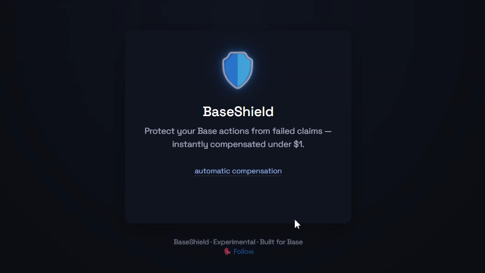
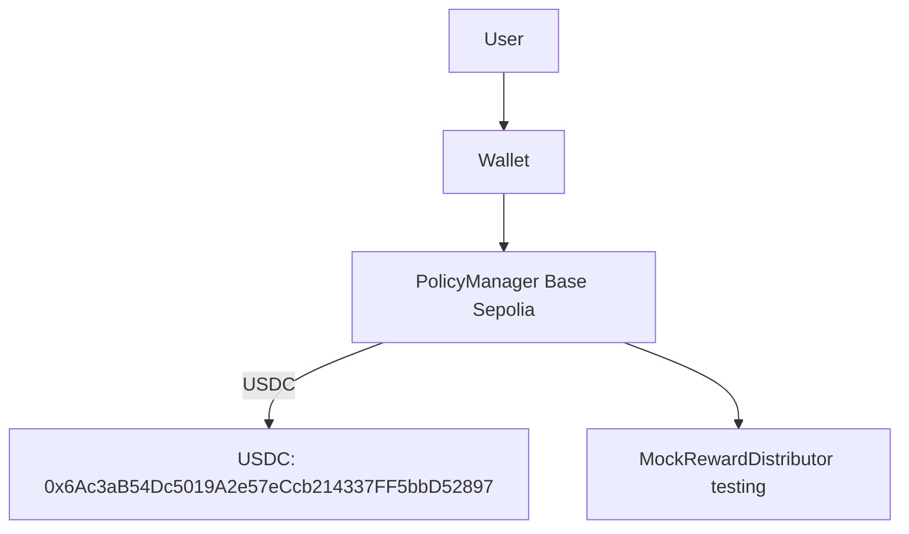

# BaseShield <a href="LICENSE"></a>   

> Automatic peace of mind for your Base actions — insurance against Web3 frustration, not market volatility.


> From idle -> protected -> compensated — all in one seamless micro-experience.

## Why BaseShield?
With Base welcoming hundreds of thousands of monthly users — many new to Web3 — everyday friction like failed claims, missed rewards, or confusing interfaces erodes trust.

BaseShield doesn’t hedge against price swings. It hedges against human error and system friction. For less than $1, get auto-compensated if your reward claim, swap, or liquidity add fails — no forms, no oracles, no intermediaries.

## Key Features
- On-chain, zero-trust protection: automated via PolicyManager.sol — no off-chain components.
- Frictionless UX: single-page frontend, wallet auto-detection (Base Wallet, MetaMask, WalletConnect).
- Dynamic Deadlines: User-defined coverage periods with built-in safety limits.
- Collision-proof Policy IDs: Nonce-based ID generation for enhanced security and reliability.
- Transparent logic: compensation triggered by verifiable on-chain events (e.g., missing RewardClaimed).
- Experimental: designed for Base Sepolia testnet. Not financial/insurance advice.

## Live Demo & Quick Start
Try locally in minutes:

```bash
# 1) Clone & install
git clone https://github.com/LCRAFTZ/baseshield && cd baseshield
npm install

# 2) Deploy contracts to Base Sepolia (requires .env)
npx hardhat run scripts/deployPolicyManager.ts --network baseSepolia

# 3) Serve the frontend
npx serve
# -> Open http://localhost:3000 and update POLICY_MANAGER_ADDRESS in index.html
```

> Before You Start
- Node.js v20 (nvm use 20 recommended)
- A funded wallet on Base Sepolia (ETH/USDC via QuickNode Faucet)
- .env with PRIVATE_KEY (see .env.example)

## Architecture Overview
A minimal smart contract (PolicyManager.sol) manages policies and payouts. The frontend (index.html) is a zero-dependency, single-file app using Ethers.js v6 — designed for trust and auditability.



## Security & Transparency
- Experimental Disclaimer: BaseShield is for educational and testing purposes only. It is not a licensed insurance product. Use at your own risk. Audit the code before use.
- .env is gitignored; .env.example is provided.
- Frontend validates contract addresses before enabling actions (ethers.isAddress).
- All fees and logic are client-side and visible; no hidden flows.
- Frontend only fetches .env when served from localhost or 127.0.0.1.

## Roadmap
- MVP: reward claim protection on Base Sepolia
- Swap & liquidity add protection
- Underwriter pool (external capital providers)
- Grant application to Base Ecosystem Fund / Coinbase / Gitcoin

## Testing & Validation
- Comprehensive unit tests (38 tests) covering core logic, dynamic deadlines, and nonces.
- End-to-end simulation on Hardhat + Base Sepolia.
- Example compensation flow: No claim -> 1.0 USDC payout validated in simulation.

## Project Structure
- contracts/ — Solidity contracts (PolicyManager.sol, mocks)
- scripts/ — deployment and simulation scripts
- test/ — unit and comprehensive tests
- index.html — single-file frontend
- deployments/ — saved deployment artifacts
- artifacts/, cache/, typechain-types/ — generated build outputs (gitignored)

## Setup
1. Install dependencies: npm install
2. Configure environment: copy .env.example -> .env and fill:
   - PRIVATE_KEY (without 0x prefix)
   - Optional: ALCHEMY_API_KEY, BASESCAN_API_KEY
3. Compile contracts: npx hardhat compile
4. Run tests: npx hardhat test

## Deployment
Deploy PolicyManager via Hardhat.

### Base Sepolia
- Ensure .env contains a funded PRIVATE_KEY.
- Run: npx hardhat run scripts/deployPolicyManager.ts --network baseSepolia
- Deployment details are saved to deployments/baseSepolia.json.

### Base Mainnet (optional)
- Ensure ALCHEMY_API_KEY and a funded PRIVATE_KEY.
- Run: npx hardhat run scripts/deployPolicyManager.ts --network base-mainnet
- If BASESCAN_API_KEY is set, you can verify contracts.

## Frontend Usage
- Serve locally (e.g., npx serve or npx http-server -p 8001).
- Set constants in index.html:
  - POLICY_MANAGER_ADDRESS to your deployed address
  - BASE_CHAIN_ID (84532 Sepolia, 8453 Mainnet)
- Enter a valid reward contract address and select coverage to enable Shield This Claim.
- If a wallet is not connected, the UI prompts connection.

## Node Compatibility
Hardhat supports Node.js v18 or v20. Using v22+ may cause errors. Recommended:

```bash
nvm install 20
nvm use 20
```

On Windows, use nvm-windows or install Node 20 directly.

## USDC Address Standardization
All scripts use the official Base Sepolia USDC: 0x036CbD53842c5426634e7929541eC2318f3dCF7e.
- Used by scripts/deployPolicyManager.ts (constructor)
- Referenced in the frontend

Local networks (hardhat, localhost) deploy a mock USDC for testing.

## Safety Checks
- Deploy scripts validate process.env.PRIVATE_KEY and fail early if missing.
- Frontend warns if POLICY_MANAGER_ADDRESS is a placeholder and disables calls until updated.

## License, Support & Attribution
- MIT License — see LICENSE
- Support: Questions, ideas or integrations — contact via X/Twitter (@Arana_lib).

## Contributing
Contributions welcome!
Whether you spot a bug, have a UX idea, or want to add new protection scenarios — open an Issue or PR. Let's make Web3 feel safer, one shield at a time.